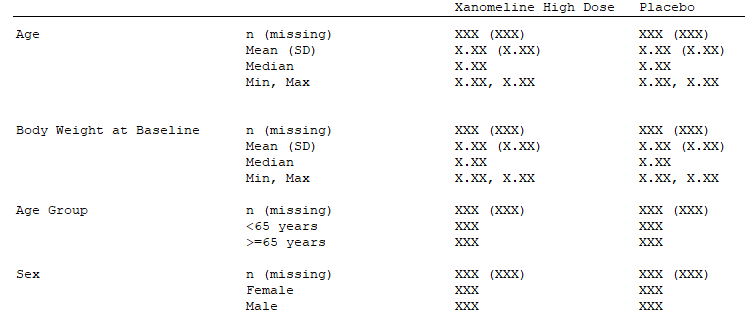

```{r, include = FALSE}
library(magrittr)
knitr::opts_chunk$set(
  collapse = TRUE,
  comment = "#>"
)
```

<!-- ```{css, echo=FALSE} -->
<!-- pre { -->
<!--   max-height: 1000px; -->
<!--   overflow-y: auto; -->
<!-- } -->

<!-- pre[class] { -->
<!--   max-height: 650px; -->
<!-- } -->
<!-- ``` -->

## Introduction
This vignette provides a library of endpoint examples, derived endpoint specifications and associated ADaM functions and statistical functions.


## ADaM functions {.tabset .tabset-fade .tabset-pills }

#### adam_01
```{r eval=FALSE}
# Merge ADSL and ADAE from {pharmaverseadam}
mk_adam_01 <- function(study_metadata) {
  
  # Read ADSL
  adsl <- data.table::as.data.table(pharmaverseadam::adsl)

  # Filter treatment arms
  adsl <- adsl[adsl$TRT01A %in% c('Placebo', 'Xanomeline High Dose')]

  # New derived ADSL age group variable
  adsl[, AGEGR2 := data.table::fcase(AGE < 65, "AGE < 65",
                                     AGE >= 65, "AGE >= 65",
                                     default = NA)]

  # New derived ADSL variable for SEX
  adsl[, SEX2 := fcase(SEX == "F", "Female",
                       SEX == "M", "Male",
                       default = NA)]
  
  # Read ADAE
  adae <- data.table::as.data.table(pharmaverseadam::adae)
  
  # Merge ADSL and ADAE
  adam_out <-
    merge(adsl, adae[, c(setdiff(names(adae), names(adsl)), "USUBJID"), with =
                       F], by = "USUBJID", all = TRUE) 
  
  # Create synthetic period flag var (for demo purpose)
  set.seed(123) # set seed for reproducibility
  adam_out[["ANL01FL"]] <- sample(c("Y", ""), size = nrow(adam_out), replace = TRUE, prob = c(0.5, 0.5))
  
  return(adam_out)
}
```

#### adam_02
```{r eval=FALSE}
# Merge ADSL and ADVS from {pharmaverseadam}
mk_adam_02 <- function(study_metadata) {
  
  # Read ADSL
  adsl <- data.table::as.data.table(pharmaverseadam::adsl)

  # Filter treatment arms
  adsl <- adsl[adsl$TRT01A %in% c('Placebo', 'Xanomeline High Dose')]

  # New derived ADSL age group variable
  adsl[, AGEGR2 := data.table::fcase(AGE < 65, "AGE < 65",
                                     AGE >= 65, "AGE >= 65",
                                     default = NA)]

  # New derived ADSL variable for SEX
  adsl[, SEX2 := fcase(SEX == "F", "Female",
                       SEX == "M", "Male",
                       default = NA)]
  
  # Read ADVS
  advs <- data.table::as.data.table(pharmaverseadam::advs)
  
  # Identify baseline body weight
  advs_bw <- advs[advs$PARAMCD == "WEIGHT" & advs$VISIT == "BASELINE"]
  
  # Create new variable BW_BASELINE
  advs_bw[["BW_BASELINE"]] <- advs_bw[["AVAL"]]
  
  # Merge ADSL, ADAE and baseline body weight from ADVS
  adam_out <-
    merge(adsl, advs_bw[, c("BW_BASELINE", "USUBJID")], by = "USUBJID", all.x = TRUE)
  
  # Create synthetic period flag var (for demo purpose)
  set.seed(123) # set seed for reproducibility
  adam_out[["ANL01FL"]] <- sample(c("Y", ""), size = nrow(adam_out), replace = TRUE, prob = c(0.5, 0.5))
  
  return(adam_out)
}
```

#### adam_03
```{r eval=FALSE}
# Merge ADSL and ADLB from {pharmaverseadam}
mk_adam_03 <- function(study_metadata) {
  
  # Read ADSL
  adsl <- data.table::as.data.table(pharmaverseadam::adsl)

  # Filter treatment arms
  adsl <- adsl[adsl$TRT01A %in% c('Placebo', 'Xanomeline High Dose')]

  # New derived ADSL age group variable
  adsl[, AGEGR2 := data.table::fcase(AGE < 65, "AGE < 65",
                                     AGE >= 65, "AGE >= 65",
                                     default = NA)]

  # New derived ADSL variable for SEX
  adsl[, SEX2 := fcase(SEX == "F", "Female",
                       SEX == "M", "Male",
                       default = NA)]
  
  # Read ADLB
  adlb <- data.table::as.data.table(pharmaverseadam::adlb) %>%
    .[.[["PARAMCD"]] == 'SODIUM' & .[["AVISIT"]] %in% c("Baseline", "Week 8", "Week 16"),]
  
  adlb2 <-
    merge(adlb,
          adlb[adlb$AVISIT == "Baseline", c("USUBJID", "AVAL")],
          by = "USUBJID", all.x = TRUE)
  
  adlb2[["VALUE_BASELINE"]] <- adlb2[["AVAL.y"]]
  adlb2[["VALUE_CHANGE"]] <- adlb2[["AVAL.x"]] - adlb2[["AVAL.y"]]
  
  # Merge ADSL and ADLB
  adam_out <-
    merge(adsl, adlb2[,c("USUBJID","PARAMCD","AVISIT","VALUE_BASELINE","VALUE_CHANGE", "ANL01FL")], by = "USUBJID", all.x = TRUE)
  
  return(adam_out)
}
```

##  Criteria functions  {.tabset .tabset-fade .tabset-pills }

#### ep_crit_min_subev_by_trt
```{r eval=FALSE}
# Endpoint criteria function: Accept endpoint if a minimum number of subjects 
# with events is present in one or both treatment arms
ep_crit_min_subev_by_trt <- function(dat,
                                     event_index ,
                                     treatment_var,
                                     subjectid_var,
                                     min_n_subev,
                                     requirement_type = c("any", "all"),
                                     ...) {
  requirement_type <- match.arg(requirement_type)

  # Evaluate if each treatment arm has enough subjects with events
  n_subev_eval <- dat[J(event_index)] %>%
    unique(., by = c(subjectid_var, treatment_var)) %>%
    .[, .(n_subev = .N), by = eval(treatment_var)] %>%
    .[["n_subev"]] >= min_n_subev

  if (requirement_type == "any") {
    return(any(n_subev_eval))
  }
  return(all(n_subev_eval))
}
```


## Statistical functions

### By treatment arm and strata {.tabset .tabset-fade .tabset-pills}

#### N
```{r eval=FALSE}
# Number of subjects
n_sub <- function(dat,
                  cell_index,
                  subjectid_var,
                  ...) {

  stat <- dat[J(cell_index)] %>%
    unique(., by = c(subjectid_var)) %>%
    nrow()

  return(data.table(
    description = "Number of subjects",
    label = "N",
    value = stat
  ))
}
```

#### n
```{r eval=FALSE}
# Number of subjects with events
n_subev <- function(dat,
                    event_index,
                    cell_index,
                    subjectid_var,
                    ...) {

  stat <- dat[J(intersect(cell_index, event_index))] %>%
    unique(., by = c(subjectid_var)) %>%
    nrow()

  return(data.table(
    description = "Number of subjects with events",
    label = "n",
    value = stat
  ))
}
```

#### %
```{r eval=FALSE}
# Proportion of subjects with events
p_subev <- function(dat,
                    event_index,
                    cell_index,
                    subjectid_var,
                    ...) {

  n_sub <- dat[J(cell_index)] %>%
    unique(., by = c(subjectid_var)) %>%
    nrow()

  n_subev <- dat[J(intersect(cell_index, event_index))] %>%
    unique(., by = c(subjectid_var)) %>%
    nrow()

  out <-
    data.table(description = "Proportion of subjects with events",
               label = "(%)",
               value = n_subev / n_sub * 100)

  return(out)
}
```

#### mean
```{r eval=FALSE}
# Mean value
mean_value <- function(dat,
                       event_index,
                       cell_index,
                       subjectid_var,
                       var,
                       ...) {
  stat <- dat[J(intersect(cell_index, event_index))] %>%
    unique(., by = c(subjectid_var)) %>%
    .[[var]] %>%
    mean()


  return(data.table(
    description = "Summary statistics",
    label = "mean",
    value = stat
  ))
}
```

#### SD
```{r eval=FALSE}
# Standard deviation
sd_value <- function(dat,
                     event_index,
                     cell_index,
                     subjectid_var,
                     var,
                     ...) {
  stat <- dat[J(intersect(cell_index, event_index))] %>%
    unique(., by = c(subjectid_var)) %>%
    .[[var]] %>%
    sd()

  return(data.table(
    description = "Summary statistics",
    label = "sd",
    value = stat
  ))
}
```

#### summary stats
```{r eval=FALSE}
# Summary statistics
summary_stats <- function(dat,
                          event_index,
                          cell_index,
                          subjectid_var,
                          var,
                          var_type = c("cont", "cat"),
                          ...) {

  # Check argument
  var_type <- match.arg(var_type)

  # Filter analysis data to cell specific content
  dat_cell <- dat[J(intersect(cell_index, event_index))] %>%
    unique(., by = c(subjectid_var))

  # Return statistics depending on the type of variable (continuous or categorical)
  if (var_type == "cont") {
    stat <- dat_cell %>%
      dplyr::summarize(
        mean = mean(get(var)),
        median = median(get(var)),
        sd = sd(get(var)),
        min = min(get(var)),
        max = max(get(var)),
        n_nonmiss = sum(!is.na(get(var))),
        n_miss = sum(is.na(get(var)))
      )
  } else {
    stat <- dat_cell %>%
      dplyr::summarize(n_nonmiss = sum(!is.na(get(var))),
                       n_miss = sum(is.na(get(var))))
  }

  return(data.table(
    description = "Summary statistics",
    label = names(stat),
    value = as.list(stat)
  ))
}
```

### By strata and across treatment arms {.tabset .tabset-fade .tabset-pills}

#### RR
```{r eval=FALSE}
# Relative Risk
rr <- function(dat,
               event_index,
               cell_index,
               strata_var,
               strata_val,
               treatment_var,
               treatment_refval,
               subjectid_var,
               ...) {

  # <Insert calculations>

  return(data.table(
    description = "Relative Risk",
    label = "RR",
    value = NA
  ))
}

```

#### OR
```{r eval=FALSE}
# Odds Ratio
or <- function(dat,
               event_index,
               cell_index,
               strata_var,
               strata_val,
               treatment_var,
               treatment_refval,
               subjectid_var,
               ...) {

  # <Insert calculations>

  return(data.table(
    description = "Odds Ratio",
    label = "OR",
    value = NA
  ))
}
```

#### p-value
```{r eval=FALSE}
pval <- function(dat,
                 event_index,
                 cell_index,
                 strata_var,
                 strata_val,
                 treatment_var,
                 treatment_refval,
                 subjectid_var,
                 ...) {

  # <Insert calculations>

  return(data.table(
    description = "p-value <insert method>",
    label = "p-value",
    value = NA
  ))
}
```


#### Hedge's G
```{r eval=FALSE}
hedgesg <- function(dat,
                    event_index,
                    cell_index,
                    strata_var,
                    strata_val,
                    treatment_var,
                    treatment_refval,
                    subjectid_var,
                    ...) {

  # <Insert calculations>

  return(data.table(
    description = "Hedges G",
    label = "Hedge's G",
    value = NA
  ))
}
```


#### Helper functions
```{r eval=FALSE}
# <Insert helper functions>
```

### Across strata and treatment arms {.tabset .tabset-fade .tabset-pills}

#### p-value interaction
```{r eval=FALSE}
pval_i <- function(dat,
                   event_index,
                   strata_var,
                   treatment_var,
                   treatment_refval,
                   subjectid_var,
                   ...) {

  # <Insert calculations>

  return(data.table(
    description = "p-value interaction test",
    label = "Interaction p-value",
    value = NA
  ))
}
```

#### Helper functions
```{r eval=FALSE}
# <Insert functions>
```

## Endpoint specification: Binary outcomes

Suppose we want to produce statistics for the following type of endpoint:

```{r fig_ep_ex1, echo=FALSE, out.width="100%", fig.align = "left"}
knitr::include_graphics("./figures/ep_spec_mockup_binary.png")
```

We note that the endpoint specification must contain statistics both by strata and treatment arm (`N`, `n`, `%`), by strata across treatment arms (`RR`, `OR`, `P-value`) and across strata and treatment arms (`P-value interaction`) which must be calculated on two strata (`Age`, `Sex`). 

We assume the endpoint concerns adverse events and must be applied to the full safety population set (`SAFFL="Y"`).

Let us consider different variations of this endpoint specification in the cases below.
In the examples we demonstrate how to apply the statistics either on the full population, by grouping on system organ class (SOCs) and severity, and filtered on severity.

Note that the set of SOCs is trimmed according to an endpoint criterion function (`ep_crit_min_subev_by_trt`), so that only SOCs with at least 5 subjects with events in at least one treatment arm are included.

##### Case 1: Adverse events (base form)

```{r eval=FALSE}
ep_spec <- mk_endpoint_str(
  data_prepare = mk_adam_01,
  treatment_var = "TRT01A",
  treatment_refval = "Xanomeline High Dose",
  pop_var = "SAFFL",
  pop_value = "Y",
  period_var = "ANL01FL",
  period_value = "Y",
  stratify_by = list(c("AGEGR2", "SEX2")),
  stat_by_strata_by_trt = list(n_sub, n_subev, p_subev),
  stat_by_strata_across_trt = list(rr, or, pval),
  stat_across_strata_across_trt = list(pval_i),
  endpoint_label = "Adverse events - <treatment_var>"
)
```


##### Case 2: Adverse events grouped by system organ class

```{r eval=FALSE}
ep_spec <- mk_endpoint_str(
  data_prepare = mk_adam_01,
  treatment_var = "TRT01A",
  treatment_refval = "Xanomeline High Dose",
  pop_var = "SAFFL",
  pop_value = "Y",
  period_var = "ANL01FL",
  period_value = "Y",
  group_by = list(list(AESOC = c())),
  stratify_by = list(c("AGEGR2", "SEX2")),
  stat_by_strata_by_trt = list(n_sub, n_subev, p_subev),
  stat_by_strata_across_trt = list(rr, or, pval),
  stat_across_strata_across_trt = list(pval_i),
  crit_endpoint = list(
    c(
      ep_crit_min_subev_by_trt,
      min_n_subev = 5,
      requirement_type = "any"
    )
  ),
  endpoint_label = "Adverse events - <AESOC> - <treatment_var>"
)
```

##### Case 3: Mild adverse events grouped by system organ class

```{r eval=FALSE}
ep_spec <- mk_endpoint_str(
  data_prepare = mk_adam_01,
  treatment_var = "TRT01A",
  treatment_refval = "Xanomeline High Dose",
  pop_var = "SAFFL",
  pop_value = "Y",
  period_var = "ANL01FL",
  period_value = "Y",
  endpoint_filter = 'ASEV == "MILD"',
  group_by = list(list(AESOC = c())),
  stratify_by = list(c("AGEGR2", "SEX2")),
  stat_by_strata_by_trt = list(n_sub, n_subev, p_subev),
  stat_by_strata_across_trt = list(rr, or, pval),
  stat_across_strata_across_trt = list(pval_i),
  crit_endpoint = list(
    c(
      ep_crit_min_subev_by_trt,
      min_n_subev = 5,
      requirement_type = "any"
    )
  ),
  endpoint_label = "Mild adverse events - <treatment_var>"
)
```

##### Case 4: Adverse events grouped by severity and system organ class

```{r eval=FALSE}
ep_spec <- mk_endpoint_str(
  data_prepare = mk_adam_01,
  treatment_var = "TRT01A",
  treatment_refval = "Xanomeline High Dose",
  pop_var = "SAFFL",
  pop_value = "Y",
  period_var = "ANL01FL",
  period_value = "Y",
  group_by = list(list(ASEV = c(), AESOC = c())),
  stratify_by = list(c("AGEGR2", "SEX2")),
  stat_by_strata_by_trt = list(n_sub, n_subev, p_subev),
  stat_by_strata_across_trt = list(rr, or, pval),
  stat_across_strata_across_trt = list(pval_i),
  crit_endpoint = list(
    c(
      ep_crit_min_subev_by_trt,
      min_n_subev = 5,
      requirement_type = "any"
    )
  ),
  endpoint_label = "<ASEV> adverse events - <AESOC> - <treatment_var>"
)
```

## Endpoint specification: Demographics

Suppose we want to produce a set of baseline summary statistics as follows:

```{r fig_ep_ex2, echo=FALSE, out.width="100%", fig.align = "left"}

```

This endpoint contains both continuous variables (`Age`, `Body Weight at Baseline`) and categorical variables (`Age Group`, `Sex`) for which different statistics are applied. So the endpoint will be split up in two endpoint specifications, one for the continuous variables (case 5), and one for the categorical variables (case 6).

In both cases a single statistical function is applied, (`summary_stats`) which compactly supplies all required statistics in one function call. Alternatively, we can define separate functions for each statistics and apply the individually in the endpoint specification.

##### Case 5: Baseline characteristics of analysis population (continuous variables)

```{r eval=FALSE}
ep_spec_pt1 <- mk_endpoint_str(
  data_prepare = mk_adam_02,
  treatment_var = "TRT01A",
  treatment_refval = "Xanomeline High Dose",
  pop_var = "SAFFL",
  pop_value = "Y",
  period_var = "ANL01FL",
  period_value = "Y",
  stat_by_strata_by_trt = list(
    "summary_stats: AGE" = c(summary_stats, var = "AGE", var_type = "cont"),
    "summary_stats: BW_BASELINE" = c(summary_stats, var = "BW_BASELINE", var_type = "cont")
  ),
  endpoint_label = "Demographics endpoint (continuous measures)"
)
```

##### Case 6: Baseline characteristics of analysis population (categorical variables)
```{r eval=FALSE}
ep_spec_pt2 <- mk_endpoint_str(
  data_prepare = mk_adam_02,
  treatment_var = "TRT01A",
  treatment_refval = "Xanomeline High Dose",
  pop_var = "SAFFL",
  pop_value = "Y",
  period_var = "ANL01FL",
  period_value = "Y",
  stratify_by = list(c("AGEGR2", "SEX2")),
  stat_by_strata_by_trt = list(
    "summary_stats: AGEGR2" = c(summary_stats, var = "AGEGR2", var_type = "cat"),
    "summary_stats: SEX2" = c(summary_stats, var = "SEX2", var_type = "cat")
  ),
  endpoint_label = "Demographics endpoint (categorical measures)"
)
```

We then collect the two endpoint specifications to cover the complete endpoint:

```{r eval=FALSE}
ep_spec <- rbind(ep_spec_pt1, ep_spec_pt2)

```

## Endpoint specification: Continuous outcomes

Suppose we want to produce the following set of baseline and change from baseline summary statistics on a given measure:

```{r fig_ep_ex3, echo=FALSE, out.width="100%", fig.align = "left"}
knitr::include_graphics("./figures/ep_spec_mockup_continuous.png")
```

We observe that mean and SD are calculated on each combination of treatment arm, strata (total and age), time (baseline, week 8 and 16).
By defining time (`AVISIT`) as the endpoint grouping we can obtain all the statistics in one endpoint specification. This implies that:

* The mean and SD are calculated by treatment and strata levels (`stat_by_strata_by_trt`) on both the analysis data columns containing the baseline (`VALUE_BASELINE`) and change from baseline column (`VALUE_CHANGE`). 
* Number of subjects (`N`) is also calculated by treatment and strata level (`stat_by_strata_by_trt`).
* For each endpoint grouping (`AVISIT`) Hedge's G is calculated by each strata level and across treatment arms (`stat_by_strata_across_trt`).

The endpoint specification is shown in case 7.

##### Case 7: Summary statistics on baseline and change from baseline

```{r eval=FALSE}
ep_spec <- mk_endpoint_str(
  data_prepare = mk_adam_03,
  treatment_var = "TRT01A",
  treatment_refval = "Xanomeline High Dose",
  pop_value = "Y",
  period_var = "ANL01FL",
  period_value = "Y",
  group_by = list(list(AVISIT = c())),
  stratify_by = list(c("AGEGR2")),
  stat_by_strata_by_trt = list(
    "n_sub" = n_sub,
    "mean: VALUE_BASELINE" = c(mean_value, var = "VALUE_BASELINE"),
    "mean: VALUE_CHANGE" = c(mean_value, var = "VALUE_CHANGE"),
    "sd: VALUE_BASELINE" = c(sd_value, var = "VALUE_BASELINE"),
    "sd: VALUE_CHANGE" = c(sd_value, var = "VALUE_CHANGE")
  ),
  stat_by_strata_across_trt = list(hedgesg),
  endpoint_label = "Baseline and change from baseline on SODIUM - <AVISIT>"
)
```
